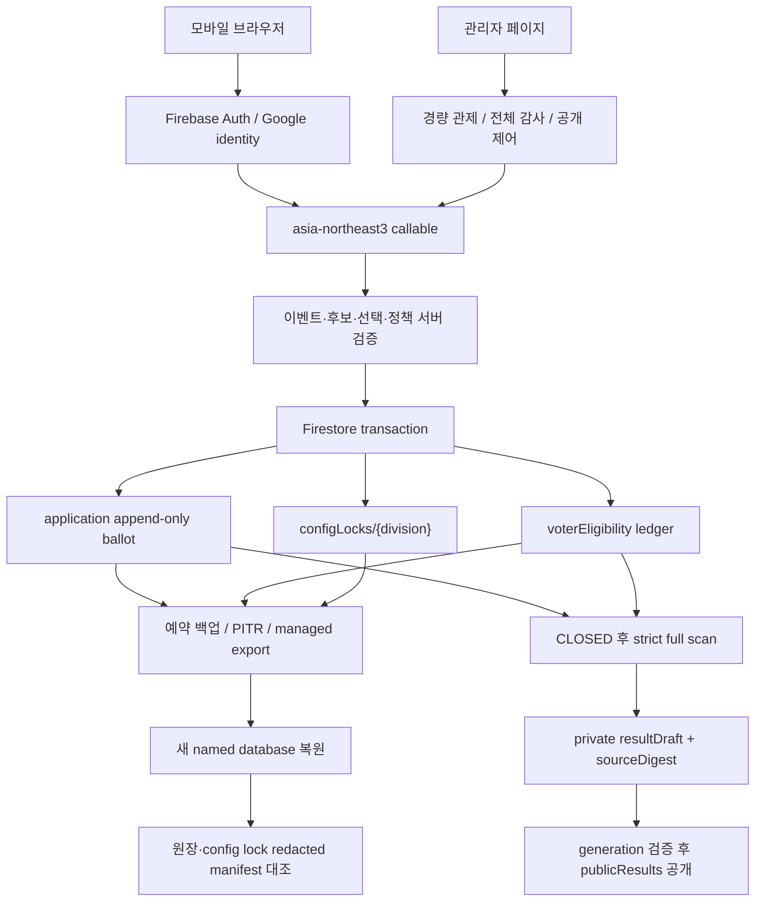

# 2026 AUBL 올스타 투표 안정성·복구 설계 기술 분석

작성 기준일: 2026-07-21
대상: AUBL 올스타 투표 서버, 관리자 도구, 결과 집계, 백업·복원 절차
목적: 향후 프로젝트 평가·비평에서 설계 의도, 구현 근거, 검증 수치와 아직 입증하지 못한 부분을 같은 기준으로 비교하기 위한 기술 기준 문서

## 1. 이 문서가 답하려는 질문

이 문서는 기능 사용 설명서가 아니다. 다음 질문에 근거를 붙여 답하는 설계·검증 보고서다.

1. 같은 Google 계정이 제한 횟수를 넘겨 투표하는 것을 어디에서, 어떤 불변식으로 막았는가?
2. 저장은 성공했지만 응답이 끊기거나 같은 요청이 동시에 들어오면 표가 중복되거나 유실되는가?
3. 후보 명단, 정책 또는 원장이 잘못됐을 때 잘못된 결과를 계속 공개하지 않고 중단할 수 있는가?
4. 장애가 발생했을 때 무엇으로 탐지하고, 어디까지 복구하며, 어떤 자료로 복구 결과를 입증하는가?
5. 현재 확보한 수치는 무엇을 증명하고 무엇을 증명하지 않는가?
6. Google Forms보다 복잡한 자체 시스템을 유지할 기술적 근거가 충분한가?
7. 투표를 열기 전에 반드시 끝내야 하는 외부 작업은 무엇인가?

문서의 상태 표기는 다음과 같다.

| 상태 | 의미 |
| --- | --- |
| 구현·로컬 검증 | 저장소 구현과 단위 또는 에뮬레이터 검증이 모두 존재함 |
| 구현·운영 적용 대기 | 코드는 있으나 Firebase/GCP 프로젝트 설정, 배포 또는 실제 기기 시험이 남음 |
| 운영 절차 | 자동 강제보다 담당자 체크리스트와 승인으로 통제함 |
| 설계 목표 | 아직 측정으로 입증하지 않았으며 리허설 후 실제값으로 교체해야 함 |

## 2. 요약 평가

현재 구현의 강점은 **접수 정합성**이다. 인증된 Google provider identity에서 가명 키를 만들고, 첫 정상 ballot·중복 방지 ledger·부문별 `configLocks/{division}`을 하나의 Firestore 트랜잭션으로 저장한다. 잠금은 후보 ID/version/hash, 정책, timezone과 이벤트 범위 HMAC Secret fingerprint를 고정한다. 이후 상태 조회와 제출은 잠금이 현재 설정과 다르거나 division 전체에 기존 ballot/eligibility가 있는데 잠금이 없으면 fail-closed한다. 서버가 contest 구성, 선택 수와 후보 자격도 다시 검사하므로 오래된 화면이나 임의 요청으로 잘못된 표를 만들기 어렵다. 동일 요청의 응답이 유실돼도 `submissionId`와 payload fingerprint가 모두 같은 경우만 멱등 성공으로 복구한다.

반면 가장 큰 미완료 영역은 **운영 가용성과 실제 재해 복구 능력의 증명**이다. PITR, 첫 `READY` 예약 백업, 새 데이터베이스 복원, 알림 수신, App Check 강제는 실제 프로젝트에서 아직 입증되지 않았다. 따라서 현재 상태를 “운영 안정성 검증 완료”라고 표현하면 과장이다.

가장 정확한 결론은 다음과 같다.

> 투표 원장 정합성, 계정별 횟수 제한, 브라우저 직접 조작 차단과 최대 20,000표의 순수 집계 계산 가능성은 로컬·에뮬레이터에서 검증했다. 실제 Cloud Functions HTTP 경로, App Check, cold start, Firestore 40,000문서 읽기, 예약 백업과 복원 시간을 포함한 운영 리허설은 투표 오픈 게이트로 남아 있다.

### 정성 평가표

아래 점수는 인증이나 외부 감사 결과가 아니라, 현재 저장소와 확보된 증거를 기준으로 한 내부 평가다.

| 영역 | 평가 | 이유 |
| --- | --- | --- |
| 원장 무결성 | 높음 | 트랜잭션, 결정적 문서 ID, 후보·선택 서버 검증, strict rebuild가 있음 |
| 중복 방지 | 높음 | 같은 Google subject·정책 기간의 신규 ballot을 서버에서 원자적으로 차단하고 첫 표의 핵심 설정을 잠금 |
| 개인정보 최소화 | 높음 | 이메일·UID·이름·IP·Google subject 원문과 선택 내용을 운영 로그에 남기지 않음 |
| 접근 통제 | 중상 | Rules와 callable 권한 경계는 강하지만 Admin SDK/IAM과 단일 관리자 권한은 별도 위험임 |
| 장애 탐지 | 중간 | 구조화 로그와 관리자 경고는 있으나 실제 alert channel 수신 시험이 남음 |
| 복구 가능성 | 중간 이하 | 도구·runbook은 있으나 실제 백업, restore drill, RPO/RTO 증거가 없음 |
| 확장성 | 중간 | 동기식 20,000표 한도 안의 계산은 여유가 있으나 Firestore I/O와 그 이상은 미검증 |
| 운영 성숙도 | 중간 | kill switch·감사·cold standby 원칙은 있으나 이중 승인과 훈련이 남음 |

## 3. 문제 정의와 위협 모델

### 3.1 보호해야 하는 자산

- 각 계정의 투표 가능 여부
- 후보 version과 후보 세트 hash
- ballot의 14개 contest, 총 24명 선택
- ballot과 `voterEligibility`의 연결 관계
- 닫힌 원장에서 재생성한 후보별 득표 수
- 결과를 만든 원장의 digest와 generation
- 복구에 필요한 Firestore 백업과 HMAC Secret

### 3.2 고려한 장애·공격 시나리오

- 버튼 연타, 복수 탭, 같은 계정의 동시 제출
- 저장 commit 이후 모바일 네트워크 응답 유실
- 오래된 후보 화면, 후보 ID 조작, 선택 수 조작
- 투표 종료 시각과 동시 요청의 경합
- 잘못된 Hosting 또는 Functions 배포
- 원장 일부 삭제·변조, ballot과 eligibility의 불일치
- 잘못된 결과 초안 또는 오래된 결과 공개
- 브라우저에서 Firestore 원장 직접 읽기·쓰기
- App Check 없이 자동화된 대량 요청
- HMAC Secret 노출·상실·이벤트 도중 회전
- 실제 Firebase 프로젝트 또는 리전 수준의 장애

### 3.3 의도적으로 보장하지 않는 것

- Google 계정 여러 개를 가진 한 사람의 다중 참여 방지
- 실명, 학번 또는 리그 회원 자격 기준의 “한 사람 1회”
- Admin SDK 권한을 탈취한 공격자에 대한 완전한 불변 원장
- 투표가 열린 동안의 실시간 결과 완전성
- 실제 운영 환경의 응답시간 SLA와 복구시간 SLA

현재 정책은 정확히 **Google 계정당 1회 또는 현지 날짜당 1회**다. 사람 단위 중복 방지로 표현하면 안 된다.

## 4. 전체 구조



핵심 원칙은 브라우저를 신뢰하지 않는 것이다. 브라우저는 후보 선택과 인증 토큰을 전달할 뿐이며, 횟수 제한·후보 자격·선택 수·현재 version·열림 상태는 서버가 다시 결정한다.

## 5. 핵심 불변식과 구현

### 5.1 인증과 가명 식별

서버는 Firebase callable이 검증한 Auth token에서 허용 provider를 확인하고 Google provider subject를 추출한다. Google identity가 없거나 모호하면 Firebase UID로 대체하지 않고 거부한다. custom 인증 bridge는 원래 Google subject를 별도 claim으로 보존한 경우만 허용한다.

문서 ID는 다음 의미의 HMAC-SHA256으로 만든다.

```text
ballot:
  HMAC(secret, "v2\nballot\n{event}\n{division}\n{period}\n{google-subject}")

eligibility:
  HMAC(secret, "v2\neligibility\n{event}\n{division}\n{google-subject}")
```

장점:

- 이메일, Firebase UID, 이름과 Google subject 원문을 저장하지 않는다.
- Firebase 계정이 삭제·재가입되어 UID가 바뀌어도 같은 Google 계정으로 판정할 수 있다.
- ballot과 eligibility 도메인을 분리해 같은 입력의 교차 사용을 막는다.
- event와 division을 입력에 포함해 올스타·루키와 새 라운드를 독립시킨다.

한계:

- HMAC ID는 익명이 아니라 가명정보다. Secret과 subject를 가진 운영자는 재계산할 수 있다.
- Secret을 이벤트 도중 바꾸면 같은 사용자가 새 ID로 보이므로 다시 투표할 수 있다.
- 현재 `voterKeyVersion`은 실제 Secret Manager version이 아니라 알고리즘 이름이다.

첫 유효 ballot 트랜잭션은 `configLocks/{division}`에 후보 세트 ID/version/hash, policy, timezone, `voterKeyVersion`과 이벤트·부문 범위의 HMAC Secret fingerprint를 함께 기록한다. Secret 원문이나 재사용 가능한 provider subject는 저장하지 않는다. 이후 상태 조회와 제출은 현재 Secret으로 fingerprint를 다시 계산해 constant-time 비교하고, 어느 필드든 다르면 `VOTING_CONFIG_LOCK_MISMATCH`로 중단한다. division 전체에 기존 ballot 또는 eligibility가 하나라도 있는데 잠금이 없으면 자동으로 추정·생성하지 않고 `VOTING_CONFIG_LOCK_MISSING`으로 중단한다. 따라서 legacy 이벤트는 별도 migration과 검증 없이 재개할 수 없다.

이 잠금은 잘못된 운영 변경을 기술적으로 차단하지만 Secret 회전을 지원하는 key ring은 아니다. 첫 표 전에 실제 Secret Manager version을 운영 증적에 고정하고 이벤트 종료까지 유지한다. 노출이 의심되면 먼저 투표를 닫고 새 event·새 Secret으로 전체 재투표할지를 결정한다.

구현 근거: [`functions/allstar_voting.py`](../functions/allstar_voting.py), [`functions/main.py`](../functions/main.py)

### 5.2 투표 횟수 정책

| 정책 | ballot 기간 키 | 차단 기준 | 다음 투표 |
| --- | --- | --- | --- |
| `ONCE_PER_EVENT` | `event` | eligibility가 한 번이라도 존재 | 같은 event·division에서는 없음 |
| `ONCE_PER_DAY` | 설정 timezone의 `YYYY-MM-DD` | `lastLocalDate`가 오늘과 같음 | 다음 현지 자정 이후 |

기본 timezone은 `Asia/Seoul`이다. 트랜잭션이 재시도되는 사이 자정이 지나도 정책 기간이 바뀌지 않도록 `request_now`를 트랜잭션 밖에서 한 번 고정한다.

정책 전환은 입장 판정만 보면 양방향으로 처리할 수 있지만, 최종 결과 생성기는 같은 부문에 정책이 섞이면 `MIXED_VOTING_POLICIES`로 중단한다. 이제 첫 유효 ballot이 policy와 timezone을 `configLocks/{division}`에 고정하므로 다음 규칙은 운영 권고이면서 서버 계약이다.

- 첫 ballot 전: 같은 event의 설정 변경 가능
- 첫 ballot 후: 변경된 policy 또는 timezone으로 상태 조회·제출하면 서버가 fail-closed
- 시작 후 정책 변경이 불가피함: 기존 부문을 닫고 새 `eventId`로 새 라운드 시작

“Firestore 설정값만 바꾸면 언제든 1일 1회로 전환 가능”이라고 설명하면 접수 판정만 설명한 것이며, 최종 집계 정합성까지 포함한 설명으로는 틀리다.

### 5.3 후보와 선택 검증

서버가 다음을 모두 확인한다.

- 현재 division이 명시적으로 열려 있고 후보 세트가 공개 상태인가
- 브라우저의 candidate version이 현재 version과 같은가
- 후보 문서의 content hash가 유효한가
- 1팀·2팀 각각 `P, C, 1B, 2B, 3B, SS, OF` contest가 정확히 존재하는가
- 일반 포지션은 정확히 1명, OF는 정확히 6명인가
- 선택 후보가 해당 contest에 속하는가
- 같은 후보가 한 contest 또는 서로 다른 contest에 중복되지 않았는가

따라서 한 표는 14 contest, 총 24명이다. 후보 공개 뒤 수정은 같은 문서를 덮어쓰지 않고 새 ID/version으로 발행하는 것이 원칙이며, 첫 표 이후 후보 변경도 새 event로 분리하는 것이 가장 감사하기 쉽다.

### 5.4 원자적 접수와 동시성

한 Firestore 트랜잭션이 다음 순서로 처리한다.

1. 이벤트와 division 상태를 다시 읽는다.
2. 인증 provider와 Google subject를 검증한다.
3. 후보 세트와 선택을 검증한다.
4. 부문별 config lock, eligibility와 현재 정책 기간 ballot을 읽는다.
5. lock이 있으면 후보 ID/version/hash, policy, timezone과 Secret fingerprint를 대조한다.
6. 기존 원장이 있는데 lock이 없으면 migration 없이 중단한다.
7. 기존 요청의 정확한 재시도인지 검사한다.
8. 첫 정상 표라면 config lock을 만들고 ballot을 `create`한다.
9. 같은 트랜잭션에서 eligibility pointer를 `set`한다.

결과적으로 잠금 없이 첫 ballot만 생기거나 ballot만 존재하거나 eligibility만 갱신되는 부분 저장을 피한다. 같은 계정의 동시 요청은 동일 원장에서 충돌하고, 서로 다른 계정의 동시 첫 요청은 같은 config lock에서 한 번 경합한 뒤 Firestore 재시도로 같은 잠금을 공유한다.

### 5.5 응답 유실과 멱등성

브라우저는 제출마다 128비트 난수 `submissionId`를 만든다. 서버는 event, division, candidate version, submission ID와 정규화한 전체 선택을 SHA-256 fingerprint로 묶는다.

정확한 멱등 성공 조건은 다음 항목이 모두 같은 경우다.

- ballot의 event·division·후보 ID/version/hash
- policy·periodKey·localDate
- voter key version
- submission ID와 fingerprint
- eligibility의 마지막 submission ID·fingerprint·ballot pointer

같은 ID라도 선택이 달라지면 성공으로 간주하지 않고 `ALREADY_VOTED`로 거부한다.

프런트는 네트워크 호출 **전에** 후보 version, 선택 fingerprint와 submission ID를 `sessionStorage`에 기록한다. 응답과 이어진 상태 조회가 모두 실패해도 사용자가 같은 선택으로 다시 누르면 같은 ID를 재사용한다. 성공, 다른 제출 확인, 후보 version 변경 또는 실제 선택 변경 시 pending 값을 폐기한다. WebCrypto나 storage를 사용할 수 없는 브라우저에서는 투표 제출은 유지하되 세션을 넘는 정확한 멱등 재시도만 축소된다.

상태 재조회에서 서버의 마지막 `submissionId`가 방금 요청과 같은 경우에만 현재 로스터를 접수된 선택으로 저장한다. 다른 탭이나 이전 제출이 먼저 접수된 경우 현재 화면의 선택을 성공 영수증으로 만들지 않는다.

구현 근거: [`src/features/allstar/lib/submissionRetry.ts`](../src/features/allstar/lib/submissionRetry.ts), [`src/features/allstar/pages/AllStarVotingPage.tsx`](../src/features/allstar/pages/AllStarVotingPage.tsx)

## 6. 결과 집계의 접근법

현재 결과 구조는 열린 투표의 증분 카운터를 최종 진실로 사용하지 않는다. 대상 이벤트 또는 division에 명시적 `CLOSED` 장벽이 있어야 전체 원장을 다시 읽는다.

### 6.1 strict rebuild

각 ballot에 대해 다음을 다시 검증한다.

- 64자리 HMAC 형식 문서 ID와 스키마
- event·division·후보 ID/version/hash
- 정책·period·현지 날짜
- submission ID와 fingerprint
- 14개 contest, 선택 수와 후보 자격
- eligibility의 마지막 ballot·submission pointer

한 건이라도 잘못되면 해당 표만 빼고 부분 집계하지 않고 전체 재생성을 중단한다. 정책이 섞여도 중단한다. 이것은 일부 표를 조용히 제외해 결과가 공개되는 것보다 장애를 명확히 드러내는 fail-closed 선택이다.

### 6.2 digest와 공개 단계 분리

검증된 모든 ballot을 결정적으로 정렬해 `sourceDigest`를 만들고, 후보 version/hash와 결과를 묶은 `generationId`를 생성한다.

1. 전체 검사 결과는 클라이언트가 읽지 못하는 `resultDrafts`에 저장한다.
2. 관리자 UI는 full audit의 ballot 무결성·ledger link·혼합 정책 경고가 모두 0일 때만 게시를 허용한다.
3. 공개 요청을 받으면 서버가 닫힌 ballot·eligibility 전체를 다시 strict rebuild한다.
4. 다시 만든 generation이 사람이 검토한 generation과 같고, event가 여전히 닫혀 있으며 현재 후보도 같을 때만 transaction으로 `publicResults`와 event 공개 gate를 함께 갱신한다.

재생성 실패가 기존 공개 결과를 덮지 않고, 오래된 관리자 화면이 새 결과를 공개하는 것도 막는다. 공개 조회도 현재 event/division이 `CLOSED`일 때만 결과를 반환하므로, 라운드를 다시 열면 이전 최종 결과를 새 투표 진행 중 결과처럼 노출하지 않는다.

다만 rebuild와 publish 직전 재검증은 정상 callable 쓰기와 일반 브라우저 조작을 막는 구조이지, Admin SDK/IAM을 가진 주체의 원본 변경을 원자적으로 봉인하는 WORM 보장은 아니다. 공격자나 수동 작업이 재검증 직후 publish transaction 사이에 같은 개수의 ballot 내용을 바꾸면 현재 generation 대조만으로 그 사이 TOCTOU를 완전히 제거했다고 말할 수 없다. 이 위험은 서비스 계정 IAM·Cloud Audit Logs·원본 수동 수정 금지의 신뢰 경계에 남아 있다. 장기적으로는 모든 원장 쓰기와 함께 증가하는 source mutation seal/generation을 두고 publish transaction에서 대조하거나, 원장을 WORM 저장소로 복제하고 변경·공개 권한을 이중 승인해야 한다.

중요한 한계는 이것이 **최종 결과 무결성 구조**이지, 투표가 열린 동안의 진정한 실시간 집계 구조는 아니라는 점이다. 실시간 현황이 필요하면 제출 transaction과 결합한 별도 aggregate 또는 주기적 snapshot을 설계하고 최종 strict rebuild와 대조해야 한다.

구현 근거: [`functions/allstar_results.py`](../functions/allstar_results.py)

## 7. 관리자·접근 통제·관측성

### 7.1 관리자 페이지

`/admin/allstar-voting`은 다음을 제공한다.

- 이벤트·division 상태, 정책, 후보 version/hash
- ballot·eligibility 수와 최근 5분·1시간 접수량
- version·정책·현지 날짜별 분포
- 최대 200개 최근 비식별 receipt와 무결성 경고
- 닫힌 원장의 수동 full audit
- 결과 초안 재생성, generation 검증 공개·숨김
- 비식별 JSON과 CSV 운영 증적

기본 조회는 집계 쿼리와 최근 문서만 사용한다. full audit는 ballot 최대 20,000개와 eligibility 최대 20,000개를 각각 검사하도록 결과 재생성 한도와 맞췄다. 최초 구현은 두 컬렉션 합산 20,000개여서 `ONCE_PER_EVENT` 약 10,000표부터 감사가 막히는 결함이 있었고, 이번 감사에서 발견해 컬렉션별 한도로 수정했다.

관리자 JSON·CSV는 복원용 원본 백업이 아니다. 파일 SHA-256은 우발적 변경 탐지에는 유효하지만 서버 서명이나 WORM 저장이 아니므로 악의적 보관자가 내용과 hash를 함께 바꾸는 공격까지 막지 못한다.

### 7.2 Firestore Rules와 IAM 경계

- 일반 사용자는 config lock, ballot, eligibility, result draft와 공개 결과 원본을 직접 읽거나 쓸 수 없다.
- 일반 `admin`은 `publicResults`를 읽을 수 있지만 원본 ballot 직접 읽기는 불가하다.
- 원본 ballot·eligibility 읽기는 `admin: true`와 `allstarVoteAuditor: true`가 모두 필요하다.
- `configLocks/{division}`은 admin·auditor를 포함한 모든 브라우저 읽기·쓰기를 차단한다.
- 모든 보호 원장 클라이언트 쓰기는 차단하고 Functions의 Admin SDK만 쓴다.
- `resultDrafts`는 모든 브라우저 클라이언트에서 차단한다.

Rules는 Admin SDK와 서비스 계정 IAM을 제한하지 않는다. 따라서 Functions 배포 권한, Secret 접근권한, Firebase Admin 역할과 Cloud Audit Logs가 실제 신뢰 경계다.

### 7.3 구조화 로그

Functions는 다음 event를 기록한다.

- `allstar_ballot_accepted`
- `allstar_ballot_rejected`
- `allstar_ballot_failed`
- `allstar_result_rebuilt`
- `allstar_result_publication_changed`

로그에는 event, division, candidateVersion, policy·period 또는 오류 reason만 넣고 토큰, 이메일, UID, IP, Google subject와 selections는 넣지 않는다. 저장소에 로그 생성 코드는 있으나 log-based alert와 notification channel은 실제 GCP 프로젝트에서 생성·수신 시험을 해야 한다.

### 7.4 App Check

웹 클라이언트는 reCAPTCHA Enterprise App Check를 초기화할 수 있고 callable은 공개/민감 경로를 별도 flag로 강제할 수 있다. 현재 기본값은 차단 사고를 막기 위해 `false`다.

운영 적용 순서:

1. 실제 웹 앱과 site key 등록
2. enforcement 없이 정상·missing·invalid 토큰 비율 관찰
3. iOS Safari·Chrome, Android Chrome, 카카오톡 인앱 브라우저 검증
4. 상태 조회·제출·관리자 등 민감 callable부터 강제
5. 이상 급증 시 event를 닫고 known-good Functions 설정으로 rollback

App Check는 자동화 호출 비용을 낮추는 보조 통제이며, 여러 유효 Google 계정을 가진 공격자를 막는 실명/Sybil 방지는 아니다.

## 8. 장애별 대응과 복구 판정

| 장애 | 즉시 조치 | 자동 안전장치 | 복구·판정 |
| --- | --- | --- | --- |
| 버튼 연타·같은 계정 동시 제출 | 추가 조치 없음 | 결정적 ID + transaction | 원장 1쌍과 reject 사유 확인 |
| commit 후 응답 유실 | 같은 화면에서 재시도 허용 | pending submission ID 재사용 + status 대조 | 같은 ID만 완료 처리 |
| 오래된 후보 화면 | 새로고침 안내 | candidate version mismatch | 현재 후보 version/hash 대조 |
| Hosting/UI 오류 | event/division을 `CLOSED` | 서버 열림 상태 재검사 | known-good Hosting 복원 후 닫힘 검증 |
| Functions 오류 | `CLOSED`, 실패 로그 보존 | 예상 밖 오류 분리 로그 | known-good revision 복원, 테스트 event 호출 |
| 후보·정책·Secret 변경 사고 | 전 부문 `CLOSED` | strict rebuild fail closed | 새 event 전체 재투표 우선 검토 |
| 원장 불일치·변조 | 원본 수정 금지 | full audit와 rebuild 중단 | 백업을 새 DB로 복원, manifest 대조 |
| 잘못된 결과 공개 | 결과 숨김 | generation·digest binding | 닫힌 원장에서 새 draft 생성 후 재공개 |
| Firebase 장기 장애 | 신규 접수 중단 공지 | 별도 자동 전환 없음 | 기존 라운드 인정/무효 결정 후 Forms 새 라운드 |

가장 중요한 kill switch는 Hosting 버튼이 아니라 Firestore event 또는 division의 명시적 `CLOSED`다. 화면이 캐시되어 있어도 서버는 새 제출을 거부한다.

## 9. 백업·복원 접근법

### 9.1 복구 계층

| 계층 | 역할 | 현재 상태 |
| --- | --- | --- |
| immutable config lock + ballot + eligibility | 핵심 설정 고정과 정상 동작 중 원장 재계산 | 구현·로컬 검증 |
| 관리자 redacted export | 장애 시점 운영 증적 | 구현·운영 적용 대기 |
| Firestore 일일 예약 백업 | DB 삭제·오염 복구 | 생성·상태 점검 도구 구현, 실제 schedule/READY 미확인 |
| PITR | 활성화 이후 세밀한 시점 복구 | 투표 직전 활성화하기로 결정, 현재 보류 |
| CLOSED 후 managed export | 종료 원장의 별도 장기 보존 | 실행·대조 도구 구현, bucket/IAM/실행 미확인 |
| named DB restore drill | 실제 복구 능력과 RTO 측정 | 검증 도구 구현, 실제 리허설 미완료 |
| Secret escrow | HMAC 연속성 복구 | 운영 절차 필요, 실제 보관·복구 시험 미완료 |

[`scripts/allstar_voting_dr.py`](../scripts/allstar_voting_dr.py)는 다음 원칙을 구현한다.

- `backup-plan`: PITR를 바꾸지 않고 필요한 명령만 출력
- `backup-status`: daily schedule, 최근 `READY`, 비정상 backup을 확인하고 48시간 초과 시 실패
- `create-daily-backup`: 기본 dry-run, `--execute`와 정확한 project 재확인이 모두 있어야 변경
- `audit`: 명시적 CLOSED 상태에서 후보·config lock·ballot·eligibility·결과를 엄격 검사하고 원장이 있는데 lock이 없거나 현재 설정과 다르면 중단
- `export`: 비동기 Cloud operation을 `SUCCESSFUL`까지 제한 시간 동안 조회하고 요청한 GCS 경로와 일치한 뒤, 실행 전후 redacted manifest가 같을 때만 source stable 판정
- `verify-restored`: 운영 `(default)` DB를 거부하고 별도 named DB의 원장, config lock의 비식별 fingerprint digest와 event/division 상태·활성화·후보/결과 공개 gate를 source manifest와 대조

export timeout은 로컬 검증 도구를 실패시키지만 이미 시작된 Cloud operation을 자동 취소하지 않는다. 자동 취소로 정상 export를 불완전하게 만들지 않기 위한 선택이며, 담당자는 반환된 operation 이름을 Cloud Console 또는 CLI에서 계속 추적해야 한다. 성공 manifest는 operation 상태와 요청 GCS 경로가 확인된 경우에만 생성된다.

managed export의 collection ID 필터는 특정 event 하위만이 아니라 데이터베이스의 같은 collection group을 포함할 수 있다. 따라서 bucket 경로가 event별이어도 export 데이터 범위가 manifest의 단일 event 검증 범위보다 넓을 수 있다. 비용·보존·복원 범위를 별도로 확인해야 한다.

백업·export에는 다음이 포함되지 않거나 별도 검증이 필요하다.

- HMAC Secret 원문과 Secret Manager 활성 version
- Firestore Security Rules와 IAM
- index, TTL, App Check 설정
- Functions·Hosting 배포본과 환경 변수
- 알림·대시보드·승인 담당자

### 9.2 RPO와 RTO

현재 실제 복원 리허설이 없으므로 **검증된 RPO와 RTO는 미정**이다.

| 지표 | 현재 보장 | 제안 목표 | 입증 방법 |
| --- | --- | --- | --- |
| 장애 탐지 후 접수 중단 | 미측정 | 5분 이내 | alert 수신부터 `CLOSED` 반영까지 훈련 |
| PITR 데이터 RPO | 미보장 | 활성화 이후 1분 이내 | earliest version time과 복원 snapshot 대조 |
| daily backup nominal RPO | schedule 미확인 | 24시간 이내 | 연속 `READY` snapshot 시각 기록 |
| 종료 원장 RPO | export 미실행 | close 시점 원장 보존 | CLOSED + pre/post manifest 일치 + operation 성공 |
| 서비스 RTO | 미측정 | named DB 검증·전환 2시간 이내 | restore→manifest→설정 재적용 전체 훈련 |

`backup-status`의 48시간은 건강 경고 임계값이지 48시간 RPO 보장이 아니다. 순수 결과 계산 11초도 end-to-end RTO가 아니다.

공식 참고:

- [Cloud Firestore 예약 백업](https://firebase.google.com/docs/firestore/backups)
- [Cloud Firestore PITR](https://firebase.google.com/docs/firestore/pitr)
- [Cloud Firestore managed export/import](https://firebase.google.com/docs/firestore/manage-data/export-import)
- [gcloud Firestore backup schedule 생성](https://docs.cloud.google.com/sdk/gcloud/reference/firestore/backups/schedules/create)
- [gcloud Firestore backup 목록](https://docs.cloud.google.com/sdk/gcloud/reference/firestore/backups/list)
- [gcloud Firestore export](https://docs.cloud.google.com/sdk/gcloud/reference/firestore/export)
- [gcloud Firestore database restore](https://docs.cloud.google.com/sdk/gcloud/reference/firestore/databases/restore)

## 10. Google Forms를 백업으로 쓰는 방식

Google Forms는 응답표, CSV와 익숙한 운영 화면이 기본 제공되는 장점이 있다. 그러나 AUBL ballot의 계정 키는 Google provider subject의 HMAC이고 Forms는 같은 가명 키를 제공하지 않는다. 개인정보를 추가 수집하지 않고 두 시스템의 동일인을 안전하게 대조할 방법이 없다.

따라서 Forms는 동시 활성화된 보조 접수처가 아니라 **cold standby**다.

1. AUBL event를 먼저 `CLOSED`로 바꾼다.
2. 마지막 정상 접수 시각과 원장 수를 보존한다.
3. 기존 라운드 전체 인정 또는 전체 무효를 회의에서 결정한다.
4. Forms를 새 event·새 기간의 전체 재투표로 연다.
5. 두 시스템 결과를 임의로 합치지 않는다.

이 원칙은 장애 시 일부 표를 살리려다 중복·개인정보 문제를 더 크게 만드는 것을 피한다.

## 11. 검증 방법과 측정 결과

### 11.1 단위 테스트

| 범위 | 결과 | 확인한 내용 |
| --- | --- | --- |
| 투표 규칙 | 포함 | provider, 후보·선택, 정책, HMAC, 멱등성 |
| 관리자 | 포함 | 권한, 비식별화, ledger pointer, 경고 |
| 결과 | 포함 | strict validation, digest, 혼합 정책 거부, close barrier |
| DR | 포함 | dry-run, project confirm, manifest, 상태 판정 |
| 성능 harness 계약 | 포함 | 유효 범위와 20,001표 거부 |
| 합계 | 82건 통과 | 2026-07-21 부문 전체 legacy 원장 잠금 검사 포함 최종 재검증 기준 |

82건은 결정적인 비즈니스 규칙, 구성 잠금 불변식, 관리자 용량 정렬과 DR operation 완료 판정의 회귀를 방지한다. 실제 HTTP, Firebase Auth, App Check, Google OAuth와 Cloud Firestore 지연은 포함하지 않는다.

### 11.2 Firestore Emulator 동시성

| 시나리오 | 결과 |
| --- | --- |
| 서로 다른 100계정, 동시성 20 | 100 성공, ballot 100, eligibility 100 |
| 같은 계정 50개 동시 요청 | 신규 1 성공, 49 `ALREADY_VOTED`, 원장 각 1 |
| 응답 유실 동일 ID·동일 선택 | `IDEMPOTENT`, 원장 각 1 유지 |
| 같은 ID·변경 선택 | `ALREADY_VOTED` |
| 다른 사용자·이전 Secret의 pre-lock 원장 | 상태 조회·제출 모두 `VOTING_CONFIG_LOCK_MISSING`, 기존 원장 각 1 유지, lock 자동 재생성 없음 |
| CLOSED event 50개 요청 | 전부 `VOTING_NOT_OPEN`, 원장 0 |
| config lock 생성 후 steady-state 40계정 동시 제출 | 40 성공, seed 포함 ballot·eligibility 각 41, lock 1. 평균 112.62ms, p50 114.37ms, p95 121.26ms, p99 122.11ms |
| 비어 있는 부문에 서로 다른 40계정 동시 최초 제출 | 40 성공, 하나의 config lock 공유. legacy 전역 검사 포함 p50 2.28초, p95 2.29초 |

이 수치는 에뮬레이터 내부 transaction 경로다. 사용자 응답시간 SLA로 사용하면 안 된다. HTTP callable, 실제 리전 네트워크, App Check, cold start, autoscaling과 운영 quota는 제외됐다. lock 생성 후 steady-state와 비어 있는 이벤트의 최초 burst는 모두 40계정 전부 성공해 정확성을 유지했지만, 최초 lock 생성에서는 transaction retry가 집중되어 p50이 114.37ms에서 2.28초로 증가했다. 두 경로를 분리해 해석해야 하며, 운영 전에는 별도 테스트 event에서 경합 경로를 리허설하고 실제 Cloud Firestore에서 최초 경합을 재측정해야 한다. 운영 event에 가짜 표를 넣어 잠금을 미리 만들지는 않는다.

### 11.3 Firestore Rules Emulator

125개 assertion이 통과했다.

- 비로그인·일반 사용자: 보호 영역 읽기·쓰기 차단
- admin 단독: 공개 결과 읽기만 허용
- auditor 단독: 보호 데이터 접근 불가
- admin + auditor: ballot·eligibility·공개 결과 읽기만 허용
- result draft: 모든 브라우저 접근 차단
- config lock: admin·auditor 조합을 포함한 모든 브라우저 읽기·쓰기 차단
- 다섯 보호 영역의 클라이언트 쓰기: 모든 시험 계정 차단

이 행렬은 Admin SDK와 IAM을 시험하지 않으며, 이벤트·후보 세트의 전체 생명주기 규칙은 추가 검증 대상이다.

### 11.4 최대 원장 순수 계산

| 항목 | 측정값 |
| --- | ---: |
| ballot | 20,000 |
| eligibility | 20,000 |
| 선택 참조 | 480,000 |
| fixture 구성 | 1.831초 |
| 검증·digest·득표 집계·ledger 연결 검사 | 9.181초 |
| 전체 | 11.012초 |
| Python traced peak | 60.12 MiB |
| 프로세스 peak RSS | 200.75 MiB |
| Functions 설정 | 300초, 1,024 MiB |

해석:

- 순수 Python 계산은 자체 120초·768 MiB 안전예산 안에 충분히 들어왔다.
- 병목 가능성이 큰 부분은 계산보다 실제 Firestore 40,000문서 읽기와 SDK snapshot 메모리다.
- 20,000표는 검증 표본인 동시에 현재 동기식 rebuild의 하드 상한이다.
- 20,000표를 넘을 가능성이 생기면 background batch, streaming 또는 별도 분석 저장소가 필요하다.

이 측정은 로컬 단일 실행이고 `tracemalloc` 영향도 있으므로 Cloud Functions 실행시간·비용 예측값으로 직접 사용하지 않는다.

### 11.5 빌드와 정적 검사

- 프로덕션 빌드 통과
- 올스타 관련 scoped ESLint 통과
- Python compile, Node syntax, JSON 검증 통과
- 저장소 전체 `npm run lint`는 올스타 범위 밖의 기존 `.tmp`, 커뮤니티·에디터 코드 오류 때문에 실패
- 전체 `npx tsc -b`도 기존 공통·커뮤니티·기록·스코어키퍼 타입 오류 때문에 실패했으며, 이번 올스타·투표 관리자 신규 파일 오류는 출력되지 않음
- 최종 빌드는 통과했다. 공통 index JS는 2,186.43 kB / gzip 606.21 kB, 올스타 지연 청크는 96.86 kB / gzip 31.26 kB이며 공통 청크 500 kB 경고가 남음

전체 lint·typecheck 실패를 이번 기능의 scoped 검사 실패로 오인해서도 안 되지만, 프로젝트 전체 품질 평가에서는 해결되지 않은 기술 부채로 그대로 기록해야 한다. Vite 빌드 성공만으로 저장소 전체 타입 건전성을 주장할 수도 없다.

## 12. 측정에서 제외된 것

다음 항목은 현재 숫자로 입증하지 않았다.

- 운영 URL에서 실제 Google 로그인부터 투표 완료까지의 E2E 성공률
- iOS Safari·Chrome, Android Chrome, 카카오톡 인앱 브라우저별 OAuth 실패율
- App Check valid·missing·invalid 비율과 enforcement 이후 차단률
- Cloud Functions cold/warm p50·p95·p99와 5xx
- 실제 Cloud Firestore transaction retry·contention·quota
- 결과 rebuild의 40,000문서 읽기 시간, read 비용과 실제 peak memory
- KST 자정 경계에서 `ONCE_PER_DAY` 동시 요청
- Secret·policy·timezone 변경 중 경합
- 알림 발생부터 운영자 수신·`CLOSED`까지의 시간
- 첫 예약 백업 생성, 복원 소요시간과 실제 RPO/RTO

따라서 향후 성능·안정성 발표에서는 “검증했다”와 “설계했다”를 구분해야 한다.

## 13. 발견한 결함과 해결 방식

### 13.1 관리자 full audit 용량 불일치

- 문제: 초기에는 `MAX_AUDIT_DOCUMENTS=20,000`을 ballot과 eligibility 합산으로 적용했다.
- 영향: `ONCE_PER_EVENT`는 한 표당 문서가 두 개라 약 10,000표부터 관리자 전체 감사가 실패했지만 결과 rebuild와 성능 시험은 각각 20,000+20,000을 허용했다.
- 해결: ballot과 eligibility 한도를 각각 20,000으로 분리하고 관리자 callable을 300초·1,024 MiB·단일 instance의 무거운 감사 경로로 명시했다.
- 남은 과제: 실제 Firestore에서 20,000+20,000 읽기 리허설과 비용 측정.

### 13.2 제출 응답과 상태 조회가 모두 끊긴 경우

- 문제: 초기에는 클릭 직전에 메모리에서 새 submission ID를 만들었으므로 두 번째 수동 시도에서 exact idempotent key를 재사용하지 못했다.
- 영향: 중복 표는 생기지 않지만 사용자는 `ALREADY_VOTED`만 보고 현재 로스터가 접수됐는지 명확히 복구하기 어려웠다.
- 해결: 네트워크 호출 전에 candidate version·선택 fingerprint·submission ID를 세션에 저장하고 동일 선택 재시도에서 재사용한다.
- 남은 과제: 실제 모바일 네트워크 차단·탭 종료·재개 리허설.

### 13.3 “설정만 바꾸면 1일 1회”라는 설명

- 문제: 입장 판정은 정책 전환을 처리하지만 결과 생성은 혼합 정책을 거부한다.
- 영향: 초기 설계에서는 투표 중 설정을 바꾸면 접수는 계속돼도 최종 자동 집계가 중단될 수 있었다.
- 해결: 첫 유효 ballot과 같은 트랜잭션에서 후보 ID/version/hash, policy, timezone, HMAC Secret fingerprint를 `configLocks/{division}`에 저장한다. 이후 불일치와 division 전체 기존 원장에 잠금이 없는 legacy 상태는 모두 fail-closed한다.
- 운영 계약: 시작 후 변경이 필요하면 기존 event를 닫고 새 event에서 전체 재투표한다. 기존 원장을 보고 잠금을 자동 생성하는 migration은 제공하지 않는다.

### 13.4 첫 config lock 생성 경합

- 문제: 빈 부문의 서로 다른 계정도 첫 요청에서는 같은 lock 문서를 동시에 읽고 쓰므로 transaction retry가 한 점에 집중된다.
- 측정: 부문 전체 legacy 원장 검사를 포함한 Firestore Emulator 재시험에서 서로 다른 40계정이 모두 성공했고 p50 2.28초, p95 2.29초였다. 별도 lock 생성 후 steady-state는 p50 114.37ms, p95 121.26ms였다.
- 해석: 정확성은 유지되지만 최초 burst의 사용자 체감 지연은 크다. 잠금 생성 후 정상 제출 지연 수치와 혼합해 평균 SLA로 제시하면 안 된다.
- 남은 과제: 운영과 같은 Cloud Firestore에서 첫 burst를 재측정하고, 필요하면 오픈 공지 전 별도 테스트 event에서 경합 경로를 리허설한다. 운영 event에 가짜 표를 넣어 잠금을 미리 만들지는 않는다.

## 14. 아직 남은 구조적 한계

### P0 — 투표 오픈 전

1. 최종 후보 ID/version/hash, policy, timezone, Secret version을 확정하고 첫 정상 표 직후 생성된 config lock의 일치 상태와 fingerprint digest를 기록한다.
2. Rules, Functions, indexes와 운영 Hosting을 같은 기준 revision으로 배포한다.
3. App Check를 관찰 모드로 적용한 뒤 실제 모바일 표본을 보고 민감 callable을 강제한다.
4. 일일 backup schedule과 첫 `READY`를 확인한다.
5. PITR를 오픈 직전에 활성화하고 earliest version time이 투표 기간을 덮는지 확인한다.
6. 새 named DB restore drill과 manifest 완전 일치를 확인한다.
7. log-based alert와 notification channel의 실제 수신을 시험한다.
8. 실제 운영 URL에서 Google 로그인·제출·응답 유실·관리자 대조 E2E를 수행한다.
9. known-good Hosting/Functions revision과 중단 권한자를 기록한다.

### P1 — 안정화

1. 최초 config lock 경합을 실제 Cloud Firestore에서 측정하고, 허용 지연 또는 구조 개선 기준을 정한다.
2. 실제 Secret Manager version을 event 운영 증적에 고정하고 향후 key ring 기반 회전·노출 대응 모델을 만든다.
3. `ONCE_PER_DAY`의 과거 모든 ballot을 1:1로 감사할 append-only period ledger를 검토한다.
4. managed export 데이터 범위와 event manifest 범위를 일치시키거나 전체 DB manifest를 추가한다.
5. 결과 rebuild를 1k·5k·10k·20k 실제 Firestore 데이터로 반복 측정한다.
6. 열려 있는 동안 현황이 필요하면 최종 strict rebuild와 분리된 live aggregate를 설계한다.
7. 후보 발행·event 열기·결과 공개에 두 사람 승인 또는 별도 approval claim을 적용한다.
8. 관리자 증적을 서버 서명하거나 별도 WORM bucket에 보존한다.

### P2 — 규모·거버넌스

1. 20,000표 초과를 위한 batch/streaming 집계 경로를 만든다.
2. automated backup-status scheduler, SLO dashboard와 정기 restore drill을 운영한다.
3. ballot·eligibility·로그·backup·export의 보존과 삭제 정책을 확정한다.
4. 프로젝트 전체 lint 기술 부채를 제거해 전체 품질 gate를 복구한다.
5. 계정 농장과 비정상 속도 패턴을 관찰하되 개인정보 최소화 원칙을 유지한다.

## 15. 투표 오픈 판단 게이트

다음 조건이 모두 충족되기 전에는 “코드가 투표를 받을 수 있음”과 “운영 준비 완료”를 구분한다.

- [ ] 최종 candidate version/hash를 두 명이 대조
- [ ] policy·timezone·Secret version 확정 기록과 첫 표 후 config lock 일치 증적
- [ ] 실제 Rules·Functions·indexes 배포 revision 기록
- [ ] 운영 URL Google OAuth와 App Check 실제 기기 검증
- [ ] 같은 계정 동시 제출과 응답 유실 E2E
- [ ] 관리자 ballot/eligibility/full audit 대조
- [ ] daily schedule 및 첫 `READY`
- [ ] PITR earliest version time 확인
- [ ] named DB restore manifest `matches: true`
- [ ] alert notification 실제 수신
- [ ] 종료 export bucket, IAM, retention과 담당자 확정
- [ ] Google Forms cold standby 전환 문구와 전체 재투표 원칙 승인
- [ ] known-good rollback revision과 `CLOSED` 담당자 확정

실행 순서와 증적 칸은 [`ALLSTAR_VOTING_OPERATIONS_CHECKLIST.md`](./ALLSTAR_VOTING_OPERATIONS_CHECKLIST.md)를 사용한다.

## 16. 향후 수집할 지표

| 영역 | 지표 | 초기 gate 제안 |
| --- | --- | --- |
| 원장 정합성 | duplicate, orphan ballot/eligibility, pointer·fingerprint 오류 | 모두 0 |
| 제출 성능 | callable p50/p95/p99, cold/warm, 5xx, transaction abort/retry | staging 기준선 후 임계치 확정 |
| 인증 | Google redirect 실패율, 기기·인앱 브라우저별 성공률 | 지원 대상별 실제 표본 확보 |
| App Check | valid·missing·invalid 요청 비율 | 강제 전 정상 토큰 비율 확인 |
| 용량 | ballot 수 / 20,000 상한 | 16,000에서 사전 경고 |
| 집계 | 1k·5k·10k·20k rebuild 시간, RSS, read 수·비용 | Functions 한도의 70% 이내 권장 |
| 백업 | 최신 READY 나이, 실패 횟수 | 48시간 stale 즉시 경고 |
| 복원 | manifest mismatch, 실제 RPO·RTO | mismatch 0, 훈련 목표 충족 |
| 관제 | 오류 발생→알림 수신→CLOSED 시간 | 측정 후 5분 목표 검토 |

## 17. 프로젝트 평가·비평을 위한 질문

향후 평가자는 다음 질문으로 설계와 운영을 분리해 비평할 수 있다.

### 정확성

- 중복 방지의 주체가 브라우저가 아니라 서버 transaction인가?
- ballot과 eligibility 중 하나만 남는 경로가 있는가?
- 후보 version 변경과 정책 변경을 결과 생성이 어떻게 처리하는가?
- 부분적으로 유효한 표를 조용히 제외하는가, 명시적으로 중단하는가?

### 개인정보와 보안

- HMAC 가명화가 “익명”으로 과장되어 있지 않은가?
- Secret·IAM·Admin SDK가 실제 신뢰 경계임을 운영자가 이해하는가?
- 관리자 증적과 Cloud Logs에 선택·계정정보가 새지 않는가?
- 단일 admin이 열기·닫기·공개를 모두 할 수 있는 구조가 적절한가?

### 신뢰성

- 응답 유실, 동시 제출과 오래된 화면을 실제 기기·운영 경로에서도 시험했는가?
- 에뮬레이터 지연을 운영 SLA로 오해하지 않았는가?
- 결과 계산 시간과 Firestore I/O·복구 시간을 구분했는가?

### 재해 복구

- 백업이 “설정됨”이 아니라 실제 `READY`이고 복원까지 성공했는가?
- PITR, scheduled backup, export, Secret escrow가 서로 다른 장애를 덮는가?
- RPO/RTO가 목표인지 실측인지 문서에 분명한가?
- 운영 DB를 덮어쓰지 않고 새 DB에서 먼저 대조하는가?

### 운영 거버넌스

- event를 닫을 권한자와 대체 담당자가 명확한가?
- Forms 전환 시 기존 표를 합치지 않는 원칙이 승인됐는가?
- 후보·정책·Secret 변경과 결과 공개에 감사 가능한 승인 기록이 있는가?
- 보존 만료 후 투표 원장과 가명정보를 실제로 삭제하는가?

## 18. 재현 명령

### Python 규칙·관리자·결과·DR 테스트

```bash
PYTHONPATH=functions functions/venv/bin/python -m unittest discover \
  -s functions/tests -p 'test_allstar_*.py'
```

### Firestore transaction 부하

```bash
npm run test:allstar:load
```

### Firestore Rules 경계

```bash
npm run test:allstar:rules
```

### 최대 20,000표 순수 집계

```bash
PYTHONPATH=functions functions/venv/bin/python scripts/allstar_result_perf.py \
  --ballots 20000
```

### 빌드와 관련 정적 검사

```bash
npm run build
npx eslint \
  src/features/allstar \
  src/app/pages/admin/AdminAllStarVotingPage.tsx \
  src/features/allstar/services/adminVotingService.ts \
  src/core/firebase/client.ts
```

### 백업 계획과 상태

```bash
PYTHONPATH=functions functions/venv/bin/python scripts/allstar_voting_dr.py \
  backup-plan --project aubl-backup --database '(default)' \
  --location asia-northeast3 --retention 14d

PYTHONPATH=functions functions/venv/bin/python scripts/allstar_voting_dr.py \
  backup-status --project aubl-backup --database '(default)' \
  --location asia-northeast3 --max-ready-age-hours 48
```

실제 외부 상태를 바꾸는 DR 명령은 기본 dry-run과 정확한 `--confirm-project` 검토를 거친 뒤 운영 체크리스트대로 실행한다.

## 19. 근거 파일 지도

| 근거 | 파일 |
| --- | --- |
| 인증, HMAC, 정책, 후보 검증, transaction | [`functions/allstar_voting.py`](../functions/allstar_voting.py) |
| callable, App Check, 구조화 로그 | [`functions/main.py`](../functions/main.py) |
| strict rebuild, digest, generation 공개 | [`functions/allstar_results.py`](../functions/allstar_results.py) |
| 관리자 redaction·감사 | [`functions/allstar_admin.py`](../functions/allstar_admin.py) |
| Security Rules | [`firestore.rules`](../firestore.rules) |
| 프런트 제출·상태 복구 | [`AllStarVotingPage.tsx`](../src/features/allstar/pages/AllStarVotingPage.tsx) |
| pending submission 재사용 | [`submissionRetry.ts`](../src/features/allstar/lib/submissionRetry.ts) |
| 관리자 화면 | [`AdminAllStarVotingPage.tsx`](../src/app/pages/admin/AdminAllStarVotingPage.tsx) |
| DR audit·backup·export·restore | [`scripts/allstar_voting_dr.py`](../scripts/allstar_voting_dr.py) |
| transaction emulator | [`scripts/allstar_vote_emulator_load.py`](../scripts/allstar_vote_emulator_load.py) |
| Rules emulator | [`scripts/allstar_firestore_rules_smoke.mjs`](../scripts/allstar_firestore_rules_smoke.mjs) |
| 20k 성능 harness | [`scripts/allstar_result_perf.py`](../scripts/allstar_result_perf.py) |
| 비기술 안정성 설명 | [`ALLSTAR_VOTING_RELIABILITY.md`](./ALLSTAR_VOTING_RELIABILITY.md) |
| 실제 운영 runbook | [`ALLSTAR_VOTING_OPERATIONS_CHECKLIST.md`](./ALLSTAR_VOTING_OPERATIONS_CHECKLIST.md) |
| 전체 기능·설정 설명 | [`functions/ALLSTAR_VOTING.md`](../functions/ALLSTAR_VOTING.md) |

## 20. 최종 판단

자체 투표 시스템을 계속 사용할 기술적 근거는 있다. Google Forms보다 복잡하지만, 후보별 선택 규칙과 version, 계정 가명 키, 원자적 ledger, 닫힌 원장 재생성까지 AUBL의 규칙을 서버에서 직접 강제할 수 있다. 특히 동시 제출과 응답 유실 상황에서도 “표가 하나만 존재한다”는 핵심 불변식은 로컬 Firestore 경로에서 확인됐다.

다만 현재 신뢰성의 중심은 **정확성 코드**에 있고, **운영 복구 능력**은 아직 도구와 절차 단계다. 실제 백업, 복원, App Check, 알림, OAuth와 클라우드 부하 리허설을 완료하기 전에는 Google Forms보다 운영상 안전하다고 단정할 수 없다. 최종 평가는 다음 두 문장을 함께 유지해야 한다.

> 접수 정합성과 결과 재현성은 강하게 구현됐다.
> 가용성과 재해 복구 보장은 실제 프로젝트 리허설이 끝나야 성립한다.
